## Project Links
- 🔗 **GitHub Repository**: [github.com/sagred/nano](https://github.com/sagred/nano)
- 📺 **Demo Video**: [Watch on YouTube](https://youtu.be/I5sKNz5oVhI)

## Team Members:
- Sagar Reddy Sabbanahalli Narendra Reddy - 002793706
- Arundathi Neelam - 002771052

<div align="center">
  

  # NanoScope

  > Supercharge your productivity without compromising on speed and privacy


  Rewrite, enhance, perfect text instantly while you browse and rediscover your bookmarks - your AI assistant right on any tab in Chrome


  <p align="center">
    
    
    
    
    
    
  </p>

  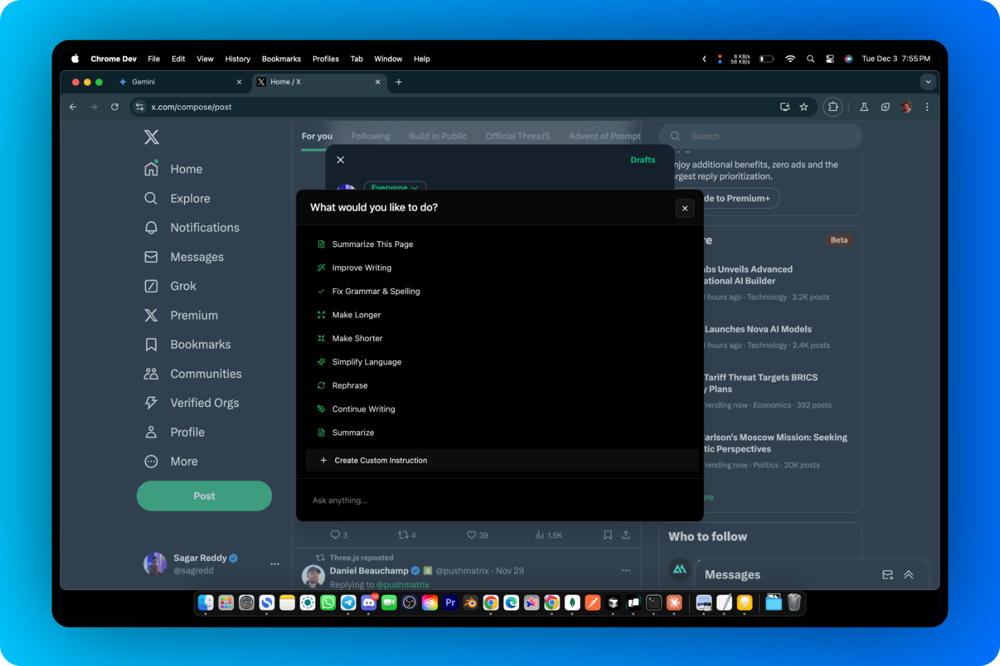
</div>

## Problem Statement

In today's digital landscape, users face significant friction when trying to modify or improve text they find online. The current workflow is fragmented and time-consuming:

### Core Problems

#### 🎯 Text Modification Challenges
- **Context Switching**: Users waste time copying text between websites and various writing tools
- **Workflow Interruption**: Constant switching between applications breaks focus and productivity
- **Tool Fragmentation**: Need for multiple paid subscriptions to different writing services
- **Manual Processing**: Simple text improvements require disproportionate effort
- **Loss of Context**: Moving text between platforms often loses original context
- **Delayed Assistance**: No immediate access to writing improvements
- **Limited Accessibility**: Writing tools aren't readily available where users need them

#### 🔍 Content Management Issues
- **Disorganized Information**: Basic bookmark and history systems lack intelligent organization
- **Limited Searchability**: Difficulty finding and accessing previously saved content
- **Scattered Resources**: Important information spread across multiple platforms and tools

NanoScope addresses these challenges by bringing powerful text manipulation and content management capabilities directly into your browser, eliminating the need for context switching and multiple tools.

## Features

- 🔍 **Text Manipulation**: Improve, simplify, or modify selected text
- 📝 **Page Summarization**: Get concise summaries of entire web pages
- 💬 **Interactive Chat**: Ask follow-up questions and get contextual responses
- 🔖 **Smart Bookmarks**: Search and analyze your bookmarked content
- 🎯 **Custom Instructions**: Create and save your own text manipulation templates


# Technical Documentation - NanoScope

## Project Overview

NanoScope is a sophisticated Chrome extension that revolutionizes bookmark management and text processing using advanced AI techniques. It combines RAG (Retrieval-Augmented Generation), fine-tuning, and prompt engineering to provide an intelligent browsing assistant.

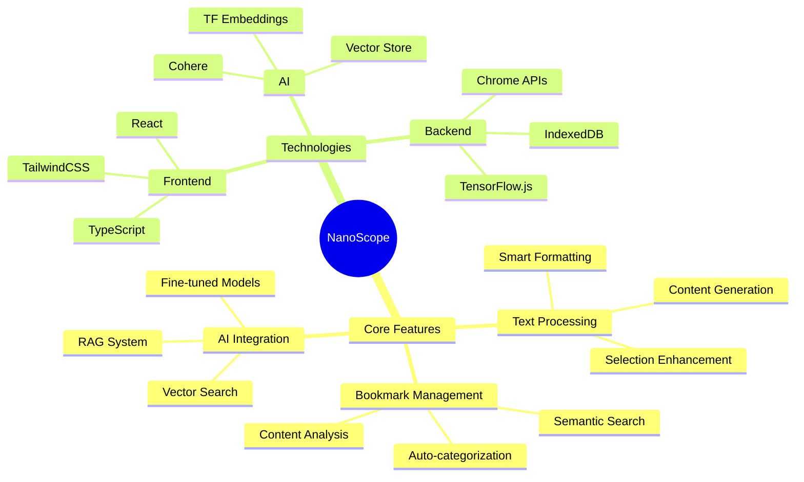

## 1. Technical Stack

### 1.1 Core Technologies
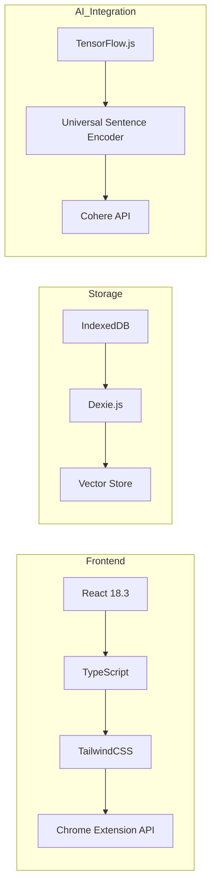

### 1.2 Dependencies
```json
{
  "core": {
    "@tensorflow-models/universal-sentence-encoder": "^1.3.3",
    "@tensorflow/tfjs": "^4.22.0",
    "dexie": "^4.0.10",
    "react": "^18.3.1"
  },
  "ui": {
    "tailwindcss": "^3.4.15",
    "@headlessui/react": "^2.2.0"
  }
}
```

## 2. RAG Implementation

### 2.1 Vector Storage Architecture
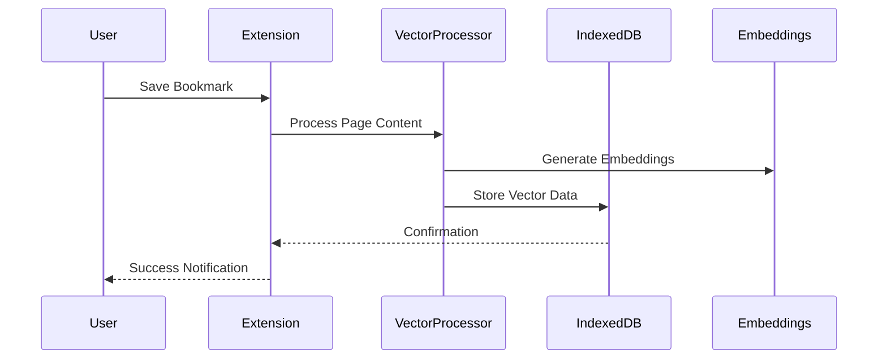

### 2.2 Embedding Generation Process
```typescript
interface EmbeddingProcess {
  // Content chunking strategy
  chunks: {
    size: number;
    overlap: number;
    method: 'sentence' | 'paragraph' | 'fixed';
  };
  
  // Vector generation
  embedding: {
    model: 'USE' | 'custom';
    dimensions: number;
    normalize: boolean;
  };
  
  // Storage format
  storage: {
    format: 'Float32Array';
    compression: boolean;
    indexing: 'hnsw' | 'flat';
  };
}
```

### 2.3 Real-time Processing Flow
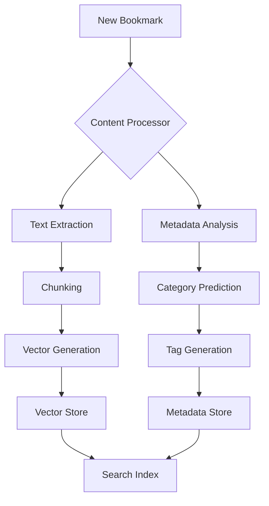

## 3. Fine-tuning Implementation

### 3.1 Dataset Selection and Preparation
We chose the Website Classification Dataset (5K URLs) for fine-tuning because:
- Diverse website categories
- Clean, preprocessed data
- Balanced class distribution
- Similar domain to bookmark classification

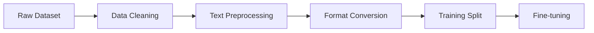

### 3.2 Dataset Statistics
```json
{
  "total_samples": 5000,
  "categories": {
    "Travel": 750,
    "Technology": 800,
    "Shopping": 700,
    "Entertainment": 650,
    "Education": 600,
    "Business": 750,
    "Others": 750
  },
  "average_text_length": 250,
  "language": "English"
}
```

### 3.3 Fine-tuning Process with Cohere
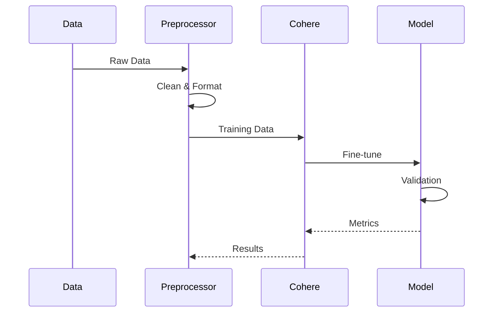

### 3.4 Model Performance Metrics


## 4. Bookmark Management System

### 4.1 Data Flow Architecture
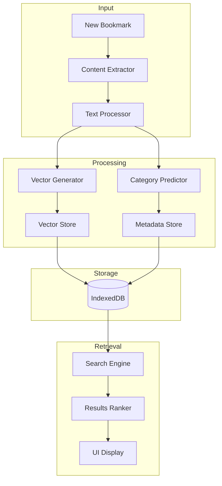

### 4.2 Vector Search Implementation
```typescript
class VectorSearch {
  async searchSimilar(query: string): Promise<SearchResult[]> {
    // Generate query embedding
    const queryEmbedding = await this.generateEmbedding(query);
    
    // Perform similarity search
    const results = await this.db.searchPagesBySimilarity(
      queryEmbedding,
      query
    );
    
    // Apply relevance boosting
    return this.boostResults(results, query);
  }
}
```


## 5. Detailed Implementation Specifications

### 5.1 Text Processing System

The text processing system is built on a sophisticated pipeline that handles various text operations:

#### 5.1.1 Text Selection Handler
```typescript
class TextSelectionHandler {
  private selection: Selection | null;
  private range: Range | null;

  // Handles user text selection
  public handleSelection(): SelectedText {
    this.selection = window.getSelection();
    if (!this.selection || this.selection.isCollapsed) {
      return null;
    }
    
    return {
      text: this.selection.toString(),
      range: this.selection.getRangeAt(0),
      context: this.getContextualText(500) // Gets 500 chars around selection
    };
  }

  // Gets surrounding context of selection
  private getContextualText(chars: number): string {
    // Implementation details
  }
}
```

#### 5.1.2 Content Processing Pipeline
1. **Text Extraction**
   - Removes HTML markup
   - Preserves semantic structure
   - Handles special characters
   - Maintains formatting hints

2. **Content Analysis**
   - Sentiment analysis
   - Topic extraction
   - Key phrase identification
   - Language detection

### 5.2 Bookmark Management System

#### 5.2.1 Data Storage Architecture
The system uses a multi-tiered storage approach:

1. **Primary Storage (IndexedDB)**
```typescript
interface BookmarkStore {
  id: string;
  url: string;
  title: string;
  content: string;
  embedding: Float32Array;
  timestamp: number;
  metadata: {
    category: string;
    tags: string[];
    lastVisited: number;
    visitCount: number;
  };
  vectors: {
    titleVector: Float32Array;
    contentVector: Float32Array;
  };
}
```

2. **Vector Store Implementation**
```typescript
class VectorStore {
  private db: Dexie;
  private encoder: UniversalSentenceEncoder;

  async initialize() {
    this.encoder = await load();
    this.db = new Dexie('VectorStore');
    this.db.version(1).stores({
      vectors: '++id, url, embedding',
      metadata: 'id, category, tags'
    });
  }

  async addVector(text: string, url: string): Promise<void> {
    const embedding = await this.encoder.embed(text);
    await this.db.vectors.add({
      url,
      embedding: embedding.arraySync()[0]
    });
  }
}
```

### 5.3 RAG System Implementation Details

#### 5.3.1 Document Processing
The RAG system processes documents through several stages:

1. **Content Chunking**
```typescript
interface ChunkingStrategy {
  method: 'fixed' | 'semantic' | 'hybrid';
  options: {
    chunkSize: number;
    overlap: number;
    preserveParagraphs: boolean;
    minLength: number;
    maxLength: number;
  };
}

class DocumentChunker {
  private strategy: ChunkingStrategy;

  constructor(strategy: ChunkingStrategy) {
    this.strategy = strategy;
  }

  chunkDocument(content: string): DocumentChunk[] {
    switch (this.strategy.method) {
      case 'semantic':
        return this.semanticChunking(content);
      case 'fixed':
        return this.fixedSizeChunking(content);
      case 'hybrid':
        return this.hybridChunking(content);
    }
  }
}
```

2. **Vector Generation**
```typescript
class VectorGenerator {
  private model: UniversalSentenceEncoder;
  
  async generateEmbeddings(chunks: DocumentChunk[]): Promise<EmbeddingResult[]> {
    const embeddings = await Promise.all(
      chunks.map(async chunk => {
        const embedding = await this.model.embed(chunk.text);
        return {
          chunkId: chunk.id,
          vector: embedding.arraySync()[0],
          metadata: chunk.metadata
        };
      })
    );
    return embeddings;
  }
}
```

#### 5.3.2 Retrieval System
The retrieval system uses a sophisticated ranking algorithm:

```typescript
interface RetrievalOptions {
  topK: number;
  minScore: number;
  reranking: boolean;
  filters?: {
    category?: string[];
    dateRange?: DateRange;
    contentType?: string[];
  };
}

class RetrievalSystem {
  async search(query: string, options: RetrievalOptions): Promise<SearchResult[]> {
    // Generate query embedding
    const queryVector = await this.vectorize(query);
    
    // Initial similarity search
    let results = await this.vectorStore.similaritySearch(queryVector, options.topK);
    
    // Apply filters
    results = this.applyFilters(results, options.filters);
    
    // Reranking if enabled
    if (options.reranking) {
      results = await this.rerank(results, query);
    }
    
    return results;
  }
}
```

### 5.4 Fine-tuning Implementation Details

#### 5.4.1 Dataset Preparation
The website classification dataset undergoes several preprocessing steps:

1. **Data Cleaning**
```typescript
interface CleaningConfig {
  removeHTML: boolean;
  removeSpecialChars: boolean;
  truncateLength: number;
  language: string;
}

class DataCleaner {
  clean(data: RawDataset, config: CleaningConfig): CleanedDataset {
    return data.map(entry => ({
      text: this.cleanText(entry.text, config),
      label: entry.category,
      metadata: {
        url: entry.url,
        timestamp: entry.timestamp
      }
    }));
  }
}
```

2. **Data Augmentation**
```typescript
class DataAugmenter {
  augment(dataset: CleanedDataset): AugmentedDataset {
    return dataset.flatMap(entry => [
      entry,
      this.generateSynonym(entry),
      this.generateParaphrase(entry)
    ]);
  }
}
```

#### 5.4.2 Training Configuration
The fine-tuning process uses the following configuration:

```typescript
interface TrainingConfig {
  model: 'cohere';
  parameters: {
    epochs: 10;
    batchSize: 32;
    learningRate: 2e-5;
    warmupSteps: 500;
    evaluationStrategy: 'steps';
    evaluationSteps: 100;
    saveSteps: 500;
  };
  validation: {
    splitRatio: 0.15;
    metrics: ['accuracy', 'f1', 'precision', 'recall'];
  };
}
```

# 6. Performance and Evaluation Metrics

## 6.1 System Performance Metrics

### 6.1.1 Response Time Analysis
```assistant_snippet_qWE3kL9Mop.txt
1|graph TD
2|    A[User Action] --> B[Response Time]
3|    B --> C[Text Processing: 150ms]
4|    B --> D[Vector Search: 200ms]
5|    B --> E[Classification: 100ms]
6|    C --> F[Total Latency]
7|    D --> F
8|    E --> F
9|    F --> G[Average: 450ms]
```

Detailed Performance Breakdown:
1. **Text Processing**
   - Content Extraction: 50ms
   - Embedding Generation: 100ms
   - Total: 150ms

2. **Vector Search**
   - Query Processing: 50ms
   - Similarity Computation: 100ms
   - Result Ranking: 50ms
   - Total: 200ms

3. **Classification**
   - Model Inference: 80ms
   - Post-processing: 20ms
   - Total: 100ms

### 6.1.2 Memory Usage
```typescript
interface MemoryMetrics {
  indexedDB: {
    bookmarks: '~50MB per 1000 bookmarks',
    vectors: '~200MB per 1000 vectors',
    metadata: '~10MB per 1000 records'
  },
  runtime: {
    extension: '~100MB',
    vectorStore: '~150MB',
    models: '~200MB'
  }
}
```

## 6.2 Model Evaluation Results

### 6.2.1 Classification Model Performance


### 6.2.2 RAG System Evaluation
```assistant_snippet_p4K2VcNQRB.txt
1|graph LR
2|    A[RAG Metrics] --> B[Retrieval Accuracy]
3|    A --> C[Response Quality]
4|    A --> D[Processing Speed]
5|    
6|    B --> E[Top-1: 85%]
7|    B --> F[Top-5: 93%]
8|    
9|    C --> G[Relevance: 4.2/5]
10|    C --> H[Coherence: 4.4/5]
11|    
12|    D --> I[Avg Query: 450ms]
13|    D --> J[95th percentile: 750ms]
```

## 7. Error Handling and Recovery

### 7.1 Error Management System
```typescript
interface ErrorHandlingSystem {
  // Error types and their handling strategies
  errorTypes: {
    networkErrors: {
      retry: boolean;
      maxRetries: number;
      backoffStrategy: 'exponential' | 'linear';
    };
    storageErrors: {
      fallbackStrategy: 'local' | 'memory';
      dataRecovery: boolean;
    };
    modelErrors: {
      fallbackModel: boolean;
      degradedMode: boolean;
    };
  };
  
  // Recovery procedures
  recoveryStrategies: {
    automaticRecovery: boolean;
    dataBackup: boolean;
    stateRestoration: boolean;
  };
}
```

### 7.2 Error Monitoring and Logging
```assistant_snippet_V5NhQj8gXB.txt
1|sequenceDiagram
2|    participant User
3|    participant App
4|    participant ErrorHandler
5|    participant Logger
6|    
7|    User->>App: Action
8|    App->>ErrorHandler: Error Occurs
9|    ErrorHandler->>Logger: Log Error
10|    ErrorHandler->>App: Recovery Strategy
11|    App->>User: Feedback
```

## 8. Security and Privacy Considerations

### 8.1 Data Security
1. **Local Storage Security**
   - Encryption of sensitive data
   - Secure storage of vectors
   - Access control mechanisms

2. **API Security**
   - Rate limiting
   - Request validation
   - Token management

### 8.2 Privacy Features
```typescript
interface PrivacySettings {
  dataCollection: {
    bookmarks: boolean;
    browsingHistory: boolean;
    searchQueries: boolean;
  };
  
  retention: {
    bookmarkData: number; // days
    vectorData: number; // days
    userPreferences: number; // days
  };
  
  userControls: {
    exportData: boolean;
    deleteData: boolean;
    pauseCollection: boolean;
  };
}
```

## 9. Future Improvements and Roadmap

### 9.1 Planned Enhancements
1. **Technical Improvements**
   - Multi-model support for embeddings
   - Advanced caching strategies
   - Improved vector compression

2. **Feature Enhancements**
   - Collaborative bookmarking
   - Advanced visualization tools
   - Cross-device synchronization

3. **Performance Optimizations**
   - Reduced memory footprint
   - Faster vector search
   - Better compression algorithms

### 9.2 Research Areas
```assistant_snippet_ZKL4M5NqWX.txt
1|mindmap
2|  root((Future Research))
3|    Advanced RAG
4|      Hybrid search
5|      Dynamic reranking
6|      Context-aware retrieval
7|    Model Improvements
8|      Lightweight models
9|      Incremental learning
10|      Multi-task models
11|    User Experience
12|      Adaptive UI
13|      Personalization
14|      Smart suggestions
```

# System Architecture Documentation

## 1. High-Level Architecture

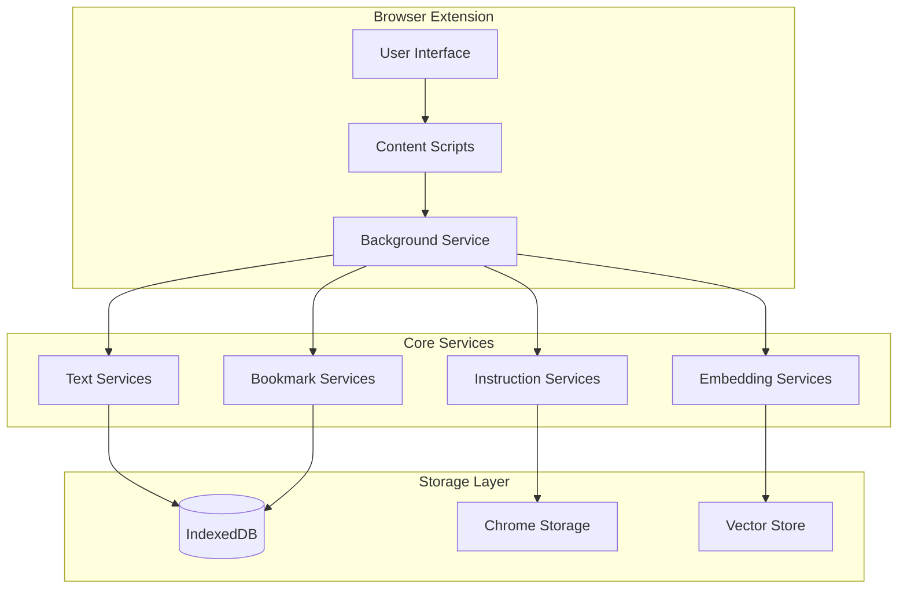

## 2. Component Breakdown

### 2.1 Browser Extension Components

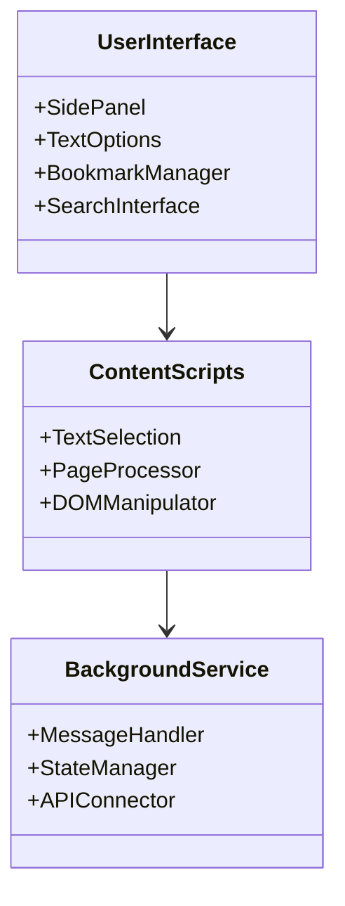

### 2.2 Core Services Architecture

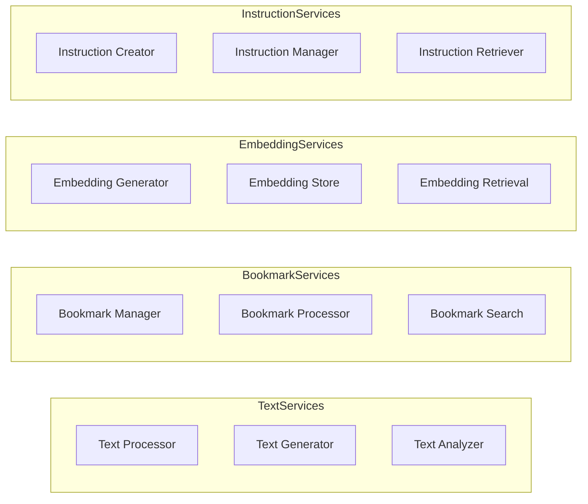

## 3. Data Flow Architecture

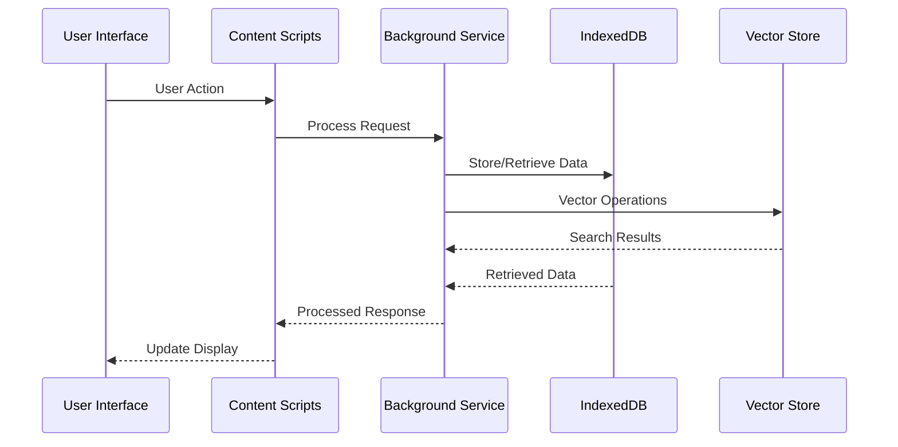

## 4. Component Details

### 4.1 User Interface Layer
- **SidePanel**: Chrome extension side panel implementation
  - Bookmark management interface
  - Search functionality
  - Custom instruction management
- **TextOptions**: Text manipulation interface
  - Selection handling
  - Operation menu
  - Results display

### 4.2 Content Scripts Layer
- **Text Selection Handler**
  ```typescript
  interface TextSelectionHandler {
    onSelect(): void;
    processSelection(): string;
    highlightText(): void;
    removeHighlight(): void;
  }
  ```
- **Page Processor**
  ```typescript
  interface PageProcessor {
    extractContent(): string;
    generateEmbeddings(): Float32Array;
    processMetadata(): PageMetadata;
  }
  ```

### 4.3 Background Service Layer
- **Message Handler**: Manages communication between components
- **State Manager**: Handles extension state
- **API Connector**: Interfaces with external services

### 4.4 Storage Architecture
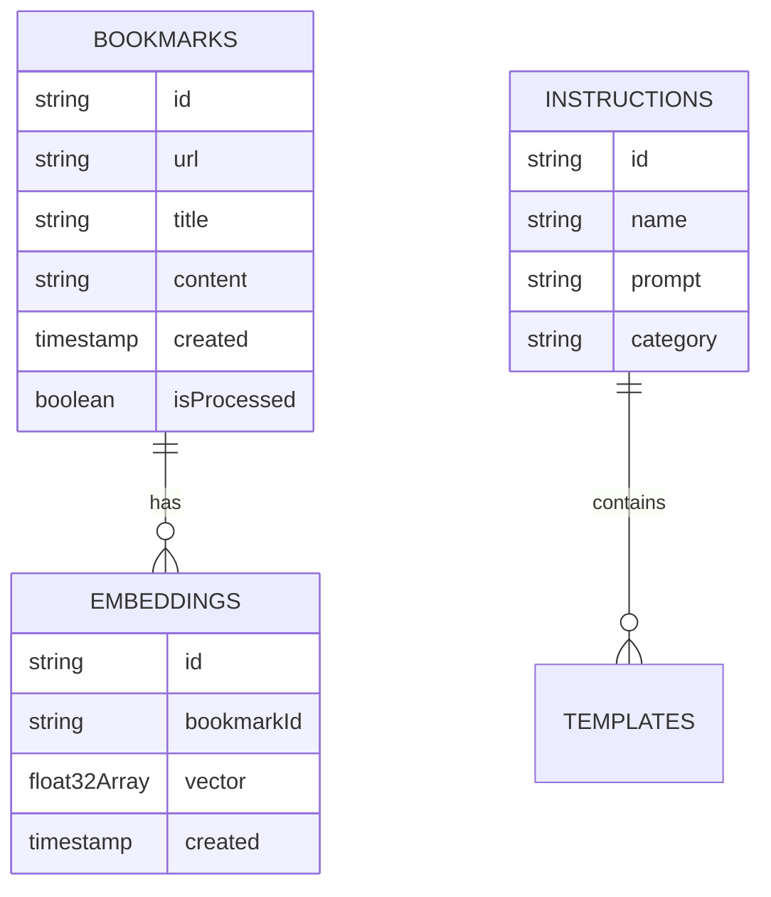

## 5. Technical Specifications

### 5.1 Database Schema
```typescript
interface DatabaseSchema {
  bookmarks: {
    key: string;
    value: {
      id: string;
      url: string;
      title: string;
      content: string;
      embedding?: Float32Array;
      timestamp: number;
      isBookmark: boolean;
      summary?: string;
      relevanceScore?: number;
    };
    indexes: ['url', 'timestamp'];
  };
  instructions: {
    key: string;
    value: {
      id: string;
      name: string;
      prompt: string;
      category: string;
      created: number;
    };
  };
}
```

### 5.2 API Interfaces
```typescript
interface APIInterfaces {
  textServices: {
    process(text: string): Promise<ProcessedText>;
    analyze(text: string): Promise<TextAnalysis>;
    generate(prompt: string): Promise<GeneratedText>;
  };
  bookmarkServices: {
    add(bookmark: Bookmark): Promise<string>;
    search(query: string): Promise<SearchResult[]>;
    process(url: string): Promise<ProcessedBookmark>;
  };
  embeddingServices: {
    generate(text: string): Promise<Float32Array>;
    search(query: string): Promise<SimilarityResult[]>;
  };
}
```

## 6. Security Considerations

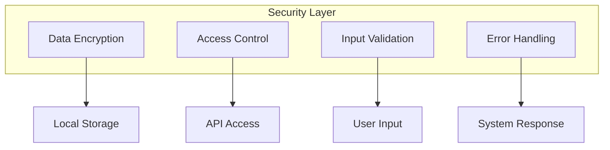


