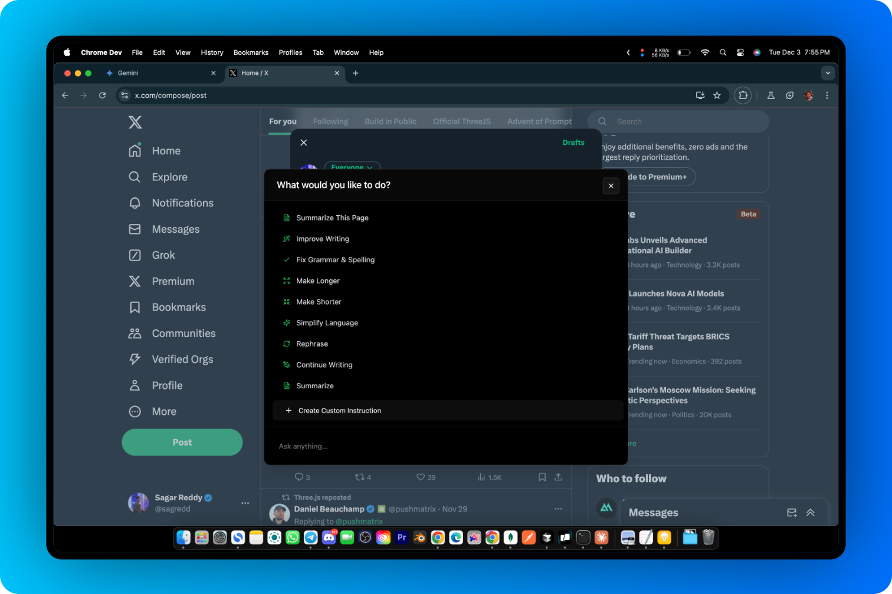

<div align="center">
  

  # NanoScope

  > Supercharge your productivity without compromising on speed and privacy


  Rewrite, enhance, perfect text instantly while you browse and rediscover your bookmarks - your AI assistant right on any tab in Chrome


  <p align="center">
    
    
    
    
    
    
  </p>

  
</div>

## Problem Statement

In today's digital landscape, users face significant friction when trying to modify or improve text they find online. The current workflow is fragmented and time-consuming:

### Core Problems

#### 🎯 Text Modification Challenges
- **Context Switching**: Users waste time copying text between websites and various writing tools
- **Workflow Interruption**: Constant switching between applications breaks focus and productivity
- **Tool Fragmentation**: Need for multiple paid subscriptions to different writing services
- **Manual Processing**: Simple text improvements require disproportionate effort
- **Loss of Context**: Moving text between platforms often loses original context
- **Delayed Assistance**: No immediate access to writing improvements
- **Limited Accessibility**: Writing tools aren't readily available where users need them

#### 🔍 Content Management Issues
- **Disorganized Information**: Basic bookmark and history systems lack intelligent organization
- **Limited Searchability**: Difficulty finding and accessing previously saved content
- **Scattered Resources**: Important information spread across multiple platforms and tools

NanoScope addresses these challenges by bringing powerful text manipulation and content management capabilities directly into your browser, eliminating the need for context switching and multiple tools.

## Features

- 🔍 **Text Manipulation**: Improve, simplify, or modify selected text
- 📝 **Page Summarization**: Get concise summaries of entire web pages
- 💬 **Interactive Chat**: Ask follow-up questions and get contextual responses
- 🔖 **Smart Bookmarks**: Search and analyze your bookmarked content
- 🎯 **Custom Instructions**: Create and save your own text manipulation templates

## Installation & Development

### Prerequisites

- Node.js (v16 or higher)
- npm or yarn
- Chrome browser

### Setup

1. Clone the repository:

```bash
git clone https://github.com/sagred/nanoscope.git
cd nanoscope
```

2. Install dependencies:

```bash
npm install
# or
yarn install
```

3. Build the extension:

```bash
npm run build
# or
yarn build
```

### Load the Extension in Chrome

1. Open Chrome and navigate to `chrome://extensions/`
2. Enable "Developer mode" in the top right corner
3. Click "Load unpacked"
4. Select the `dist` folder from your project directory

### Development

Run the development server:

```bash
npm run dev
# or
yarn dev
```

The extension will auto-reload as you make changes.

## Usage

- Press `Ctrl+M` (Windows) or `Cmd+M` (Mac) to open text options
- Click the extension icon to open the side panel
- Select text and right-click to access context menu options

## Project Structure

```
nanoscope/
├── src/
│   ├── background/     # Chrome extension background scripts
│   ├── components/     # React components
│   ├── content-scripts/# Chrome extension content scripts
│   ├── hooks/         # Custom React hooks
│   ├── services/      # Core services and utilities
│   └── styles/        # Global styles and themes
├── public/            # Static assets
└── dist/             # Build output
```

## Tech Stack

- **Frontend**
  - React + TypeScript
  - TailwindCSS
  - Chrome Extension APIs (Manifest V3)

- **AI & ML**
  - TensorFlow.js
  - Universal Sentence Encoder
  - Cohere (Fine-tuning)

- **Storage**
  - IndexedDB (via Dexie.js)
  - Chrome Storage API

- **Build Tools**
  - Vite
  - SWC
  - ESLint

- **UI Components**
  - Radix UI
  - Lucide Icons

- **Testing**
  - Jest
  - React Testing Library

<p align="center">
  
  
  
  
  
</p>

## Contributing

1. Fork the repository
2. Create your feature branch (`git checkout -b feature/AmazingFeature`)
3. Commit your changes (`git commit -m 'Add some AmazingFeature'`)
4. Push to the branch (`git push origin feature/AmazingFeature`)
5. Open a Pull Request

## License

[MIT License](LICENSE)

## Acknowledgments

- Built with [Vite](https://vitejs.dev/)
- UI components from [shadcn/ui](https://ui.shadcn.com/)
- Icons from [Lucide](https://lucide.dev/)
